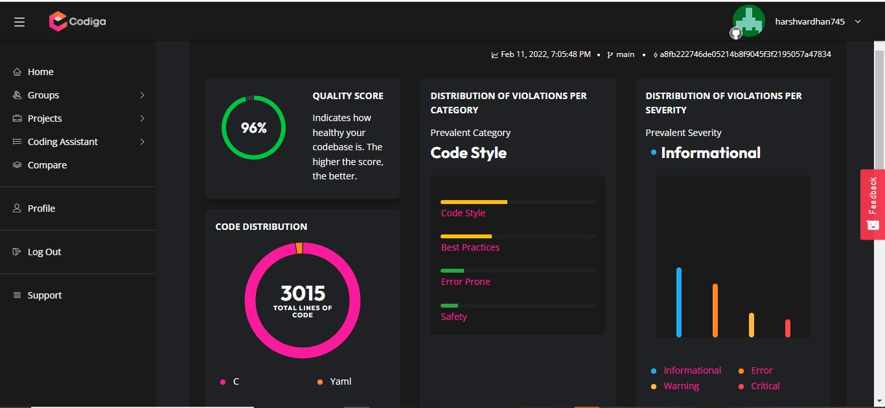

# M1_DepartmentalStoreManagementSystem_Application
This is a Application called Departmental Management System and it is very helpful in the management of a department store where you can add goods , edit goods , search goods ,  delete goods and display goods .

# Static analysis of code
  - *Cppcheck
)

  - *codiga code analysis

  
  - *code inspector code analysis
 

 - *Codacy badge

 - *valgrind analysis
()

  - *codiga analysis

